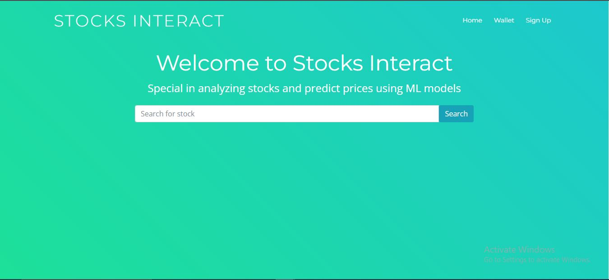

# Stocks Interact



The [Stocks Interact](https://sotcksinteract.onrender.com) project is web app that analyze and predict the stock prices using ML models [GiHub repository](https://github.com/husseinhassan92/Stocks_Interact.git)


## Installing the required packages

Install and update using [pip](https://pip.pypa.io/en/stable/quickstart/):

```bash
pip install -r requirements.txt
```

## Run the web app

```bash
python run.py
```
## Built With
- Python -> The Backend Language
- Javascript -> The Frontend Language
- Flask -> The Web Development Framework
- SQLAlchemy -> Python SQL Toolkit and Object Relational Mapper
- SQLite - Relational Database Management System
- Pandas -> Data manipulation and analysis
- Plotly -> Data visualization and create interactive graphs, charts
- Statsmodels -> Estimate statistical model for timeseries data
- Tensorflow -> create deep learning model to perform predication

## Developer
### [Hussein Hassan](https://www.linkedin.com/in/hussein-hassan-513725256/)
Data scientist & Full Stack Developer

## The story 
When I started learning about data science, I was enthusiast about market. Every time I tried to learn more, the market seemed way too complex for me to grasp.
What I found was pretty remarkable. There are statistically relevant and actionable data that have a strong correlation with future price-actions with far superior efficacy than techniques like chart patterns, running averages, and, well, most standard tools available.
Now that I have found the data and tools, I want to share them with you so you do not have to go through all of the same effort and troubles that I did in finding valid stock market data. That way, you can focus on what matters: learning about the market in clear and actionable ways.

## [Live demo](https://youtu.be/Z7xWvJ-psWE)
Here a demo [video](https://youtu.be/Z7xWvJ-psWE) to demonstrate the web app and its features 


